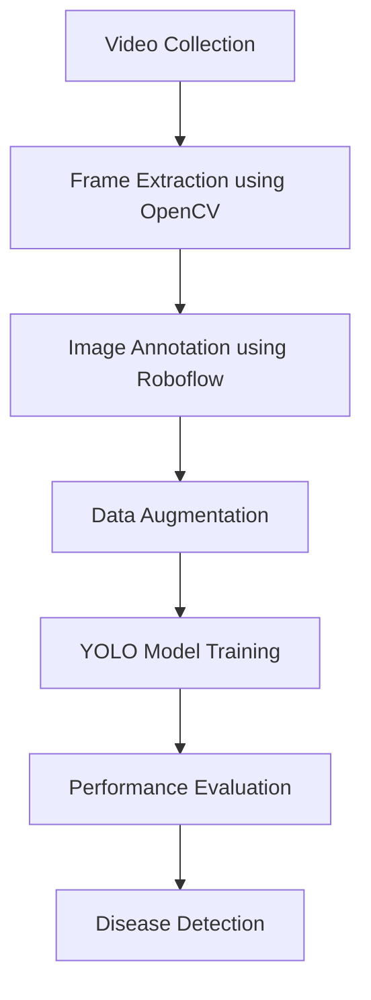

# 🌿 Green Amaranth Leaf Disease Detection using YOLO

## 📌 Overview

This project presents a deep learning-based solution for detecting diseases in Green Amaranth leaves using the YOLO (You Only Look Once) object detection framework. The system identifies diseased and healthy leaves in real time, helping farmers, agricultural inspectors, researchers, and vendors take early preventive measures for crop health management.

This study represents one of the earliest applications of YOLO-based object detection techniques for Green Amaranth leaf disease detection and establishes a baseline framework for future agricultural computer vision research.

---

## ⭐ Highlights

* First YOLO-based object detection framework for Green Amaranth leaf disease detection.
* Published in IEEE AISP 2025.
* Custom agricultural dataset collected from multiple Indian states.
* Comparative performance analysis of YOLOv8m and YOLOv9m.
* Real-world field data collected under varying environmental conditions.
* Designed for future deployment in precision agriculture systems.

---

## 🎯 Objectives

* Collect Green Amaranth leaf images from real-world agricultural environments.
* Extract image frames from videos using OpenCV.
* Annotate diseased and healthy leaves using Roboflow.
* Train YOLOv8m and YOLOv9m object detection models.
* Compare model performance using standard evaluation metrics.
* Develop a baseline system for real-time disease detection.

---

## 🚀 Features

* Real-time leaf disease detection.
* Custom dataset generation from agricultural videos.
* Two-class object detection:

  * Diseased Leaf
  * Healthy Leaf
* Data augmentation for improved robustness.
* Performance comparison between YOLOv8m and YOLOv9m.
* Suitable for smart agriculture applications.
* Supports future deployment on mobile and edge devices.

---

## 🏗️ Methodology Workflow

---

## 🛠️ Technologies Used

* Python
* OpenCV
* Roboflow
* YOLOv8m
* YOLOv9m
* Ultralytics Framework
* PyTorch
* Deep Learning
* Computer Vision

---

## 📂 Dataset Creation

### Data Collection

Videos were collected from agricultural gardens across:

* West Bengal
* Assam
* Sikkim

### Frame Extraction

* Frames extracted every 10 ms.
* Approximately 1600+ image frames generated.

### Annotation

* Annotation Platform: Roboflow
* Bounding boxes manually drawn around visible leaves.

### Classes

| Class ID | Label       |
| -------- | ----------- |
| 0        | Disease     |
| 1        | Not Disease |

---

## 🔄 Data Augmentation

The following augmentation techniques were applied:

* Rotation (-10° to +10°)
* Grayscale Conversion (10% Images)
* Brightness Adjustment (±20)
* Gaussian Blur
* Random Transformations

These augmentations improve model generalization and reduce overfitting.

---

## 🧠 Model Architecture

### YOLOv8m

* Input Size: 640 × 640
* Parameters: 25.9M
* FLOPs: 78.9B

### YOLOv9m

* Input Size: 640 × 640
* Parameters: 20.1M
* FLOPs: 76.8B

---

## ⚙️ Training Configuration

| Parameter              | Value            |
| ---------------------- | ---------------- |
| Train/Validation Split | 80/20            |
| Epochs                 | 5                |
| Optimizer              | SGD              |
| Framework              | Ultralytics      |
| GPU                    | NVIDIA RTX A4000 |
| RAM                    | 128 GB           |
| CPU                    | Intel Core i7    |

---

## 📊 Results

### YOLOv8m

| Metric       | Value |
| ------------ | ----- |
| Precision    | 0.487 |
| Recall       | 0.477 |
| mAP@0.5      | 0.422 |
| mAP@0.5:0.95 | 0.177 |
| F1 Score     | 0.480 |

### YOLOv9m

| Metric       | Value |
| ------------ | ----- |
| Precision    | 0.461 |
| Recall       | 0.432 |
| mAP@0.5      | 0.346 |
| mAP@0.5:0.95 | 0.150 |

---

## 🏆 Key Findings

* YOLOv8m outperformed YOLOv9m across all evaluation metrics.
* Achieved 21.7% higher mAP@0.5.
* Achieved 18.1% higher mAP@0.5:0.95.
* Faster convergence during training.
* Better localization and classification performance.
* More suitable for agricultural monitoring applications.

---

## 📈 Evaluation Metrics

The following metrics were used to evaluate model performance:

* Precision
* Recall
* F1 Score
* mAP@0.5
* mAP@0.5:0.95
* Classification Loss
* Bounding Box Loss
* Distribution Focal Loss (DFL)

---

## 📊 Model Evaluation Visualizations

The repository includes:

* Precision–Recall Curve
* Precision Curve
* Recall Curve
* F1 Confidence Curve
* Confusion Matrix
* Training Loss Curve
* Validation Loss Curve
* mAP Curve

These visualizations provide deeper insights into model performance and prediction quality.

---

## 📸 Sample Predictions

The trained models successfully detect healthy and diseased Green Amaranth leaves under varying environmental conditions.

### Detection Classes

✅ Diseased Leaf

✅ Healthy Leaf

---

## 🔬 Research Contribution

This study contributes to agricultural computer vision by:

* Developing a custom Green Amaranth disease dataset.
* Investigating YOLO-based disease detection.
* Establishing benchmark performance results.
* Supporting future research in smart agriculture.
* Providing a scalable framework for automated crop monitoring.

---

## ⚠️ Challenges Faced

* Complex outdoor backgrounds.
* Variations in lighting conditions.
* Similar appearance between healthy and diseased leaves.
* Leaf overlap and occlusion.
* Limited dataset size.

These challenges make the detection task more realistic and practically relevant.

---

## 🌍 Applications

* Smart Agriculture
* Precision Farming
* Crop Health Monitoring
* Disease Surveillance
* Food Safety Management
* Agricultural Research
* AI-powered Farming Solutions

---

## 🔮 Future Scope

* Increase dataset size.
* Include additional disease categories.
* Train models with 100+ epochs.
* Hyperparameter optimization.
* Real-time smartphone deployment.
* Edge-device implementation.
* Development of a farmer-friendly mobile application.
* Cloud-based crop disease monitoring system.

---

## 🖥️ Hardware and Software Environment

### Hardware

* NVIDIA RTX A4000 GPU
* Intel Core i7 Processor
* 128 GB RAM

### Software

* Python
* OpenCV
* Roboflow
* Ultralytics
* PyTorch
* Google Colab

---

## 📝 Conclusion

This study demonstrates the effectiveness of YOLO-based deep learning for automated Green Amaranth leaf disease detection. Experimental results show that YOLOv8m achieves superior performance compared to YOLOv9m, enabling accurate and reliable disease identification. The proposed framework highlights the potential of AI and Computer Vision in advancing precision agriculture and intelligent crop health monitoring.

---

## 📄 Publication

**Paper Title:** Utilizing YOLO-framework for Green Amaranth Leaf Disease Detection

**Conference:** 2025 5th International Conference on Artificial Intelligence and Signal Processing (AISP)

**Publisher:** IEEE

**DOI:** 10.1109/AISP66545.2025.11396176

**IEEE Xplore:** https://ieeexplore.ieee.org/document/11396176

---
## 🌟 One-Line Summary

🌿 A YOLO-powered deep learning framework for automated Green Amaranth leaf disease detection, enabling intelligent crop health assessment, early disease diagnosis, and AI-driven precision agriculture.

